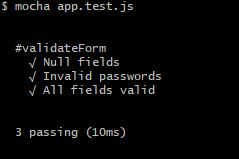
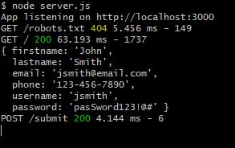

# expressoTests
Javascript Testing Demo with Mocha and Chai

This is a mock sign up page with a form validation to demonstrate Mocha and Chai Javascript Testing. 

## Getting Started
If you don't already have [Node.js](https://nodejs.org/en/), you can download it with the default configurations.

### Installing

Clone or download this repo, and then in your terminal, navigate to directory and install the dependencies with

```
npm install
```

## Running the tests

Then, navigate to the test folder and run the test with: 

```
mocha app.test.js
```

Assuming the tests pass, it should look like this:



Play around with the validateForm() function, and see how that changes the results of the test.


## Using the app

If you want to see how the actual app functions, navigate to the root directory in your terminal and start the server:

```
node server.js
```

And head to [http://localhost:3000/](http://localhost:3000/)

After you have submitted some sample credentials, the console should look like this:



The credentials you typed in should appear in the console, and the result should open in a new tab in your browser.


### Built With

* [Node.js](http://www.dropwizard.io/1.0.2/docs/)
* [Express.js](https://expressjs.com/) - Node Framwork
* [Mocha](https://mochajs.org/) - Javscript Test Framework
* [Chai](http://www.chaijs.com/) - Assertion Library
* [Morgan](https://www.npmjs.com/package/morgan) - HTTP request logger middleware

### Author

* **Josh Hedstrom** - [jhedstrom.com](https://www.jhedstrom.com)

### License

This project is licensed under the MIT License - see the [LICENSE.md](LICENSE.md) file for details

### Acknowledgements

* [This Regex password validation tutorial](https://dzone.com/articles/use-regex-test-password)
